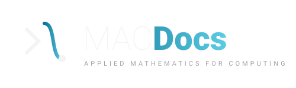
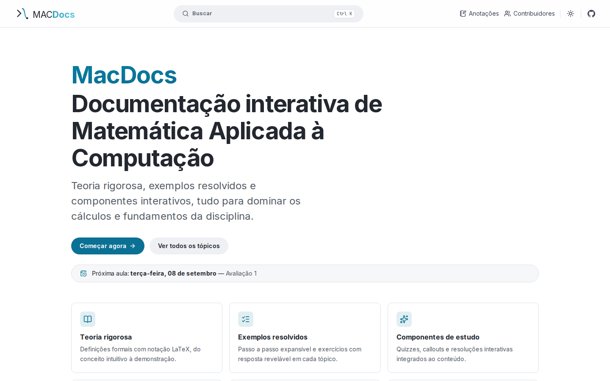
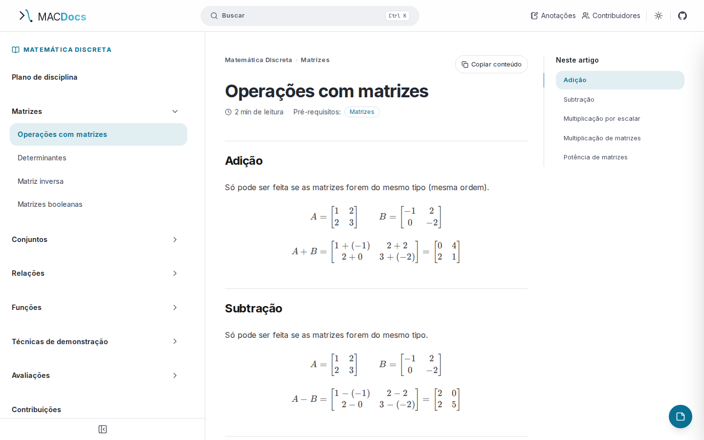

<br>
<div align="center">
  
  
  
  
</div>
<br>

<p align="center">
  <a href="https://github.com/dariomatias-dev/mac-docs/actions/workflows/ci.yml">
    
  </a>
  <a href="https://codecov.io/gh/dariomatias-dev/mac-docs">
    
  </a>
  
  <a href="LICENSE">
    
  </a>
</p>

<p align="center">
  <a href="README.md">English</a> · <strong>Español</strong> · <a href="README.pt-BR.md">Português (Brasil)</a>
</p>

<h1 align="center">MacDocs</h1>

<p align="center">
  
</p>

<p align="center">
  Documentación interactiva de Matemática Aplicada a la Computación, generada a partir de MDX con fórmulas en LaTeX, búsqueda de texto completo y componentes de estudio interactivos.
  <br>
  <a href="#sobre-el-proyecto"><strong>Explora la documentación »</strong></a>
  <br>
  <br>
  <a href="https://github.com/dariomatias-dev/mac-docs/issues">Reportar Bug</a> ·
  <a href="https://github.com/dariomatias-dev/mac-docs/issues">Solicitar Funcionalidad</a>
</p>

## Índice

- [Sobre el Proyecto](#sobre-el-proyecto)
- [Preview](#preview)
- [Funcionalidades](#funcionalidades)
- [Contenido](#contenido)
- [Tecnologías](#tecnologías)
- [Arquitectura](#arquitectura)
- [Primeros Pasos](#primeros-pasos)
- [Scripts](#scripts)
- [Pruebas](#pruebas)
- [Despliegue](#despliegue)
- [Documentación](#documentación)
- [Contribuir](#contribuir)
- [Seguridad](#seguridad)
- [Licencia](#licencia)
- [Autor](#autor)

</br>

## Sobre el Proyecto

MacDocs es un sitio de documentación totalmente estático (SSG) al estilo de
react.dev. Convierte un árbol de archivos MDX en un sitio navegable,
buscable e interactivo. Basta con agregar un archivo `.mdx` para generar una
ruta, un elemento en la barra lateral, breadcrumb, navegación
anterior/siguiente y una entrada en el buscador.

## Preview

<p align="center">
  
  <br><em>Página de inicio</em>
  <br><br>
  
  <br><em>Una página de documentación, con la barra lateral, el índice del artículo y una fórmula renderizada</em>
</p>

## Funcionalidades

- Renderizado de MDX con GFM y KaTeX (matemáticas en línea y en bloque).
- Barra lateral jerárquica derivada de la estructura de carpetas, con grupos
  colapsables cuyo estado se persiste.
- Búsqueda de texto completo abierta con `Ctrl`/`Cmd` + `K`, con ranking y
  navegable por teclado.
- Componentes de estudio interactivos: Callout, Collapsible, Exercise, Quiz,
  StepByStep, YouTube y, en páginas de evaluación, Question, Badge,
  Resolution, Proof, Alternatives, PixelGrid, RegionDiagram y calculadoras de
  conjuntos/matrices.
- Tabla de contenidos con scroll spy en escritorio y menú desplegable en
  móvil.
- Tiempo de lectura y chips de prerrequisitos por página.
- Anotaciones por página, guardadas localmente, con búsqueda, orden,
  exportar/importar y deshacer al eliminar.
- Página de colaboradores (monitoría, material y código vía API de GitHub).
- Tema claro y oscuro que sigue al sistema, sin parpadeo.
- SEO: sitemap, robots, Open Graph, URLs canónicas y 404 personalizado.
- Cabeceras de seguridad y Content Security Policy.

## Contenido

El contenido vive en [`content/`](content/), organizado en tres niveles:

```
content/<curso>/<grupo>/<página>.mdx
```

Crear un archivo `.mdx` genera automáticamente ruta, elemento en la barra
lateral, breadcrumb, navegación anterior/siguiente y entrada en el buscador.
Ver [docs/authoring.es.md](docs/authoring.es.md).

## Tecnologías

- Next.js (App Router, Turbopack), React y TypeScript en modo strict.
- Tailwind CSS v4 con el plugin de tipografía.
- MDX vía `next-mdx-remote/rsc` y `gray-matter`.
- KaTeX (`remark-math`, `rehype-katex`), `remark-gfm` y `rehype-slug`.
- `next-themes`, `lucide-react` y `zod`.
- Vitest con Testing Library, y Playwright con axe.
- ESLint, Prettier, Husky, commitlint y GitHub Actions.

## Arquitectura

El código está organizado feature first en `src/features/*`, con solo lo
genuinamente compartido en `src/shared/*`. Los imports entre features solo se
permiten a través del barril `index.ts` de cada feature, garantizado por
`import/no-restricted-paths` de `eslint.config.mjs`. Ver
[docs/architecture.es.md](docs/architecture.es.md).

## Primeros Pasos

```bash
pnpm install
cp .env.example .env.local   # define NEXT_PUBLIC_SITE_URL
pnpm run dev                  # http://localhost:3000
```

## Scripts

| Comando              | Descripción                  |
| -------------------- | ---------------------------- |
| `pnpm run dev`       | Servidor de desarrollo       |
| `pnpm run build`     | Build de producción (SSG)    |
| `pnpm run start`     | Sirve el build de producción |
| `pnpm run lint`      | ESLint                       |
| `pnpm run typecheck` | `tsc --noEmit`               |
| `pnpm run format`    | Prettier (escritura)         |
| `pnpm run test`      | Vitest (watch)               |
| `pnpm run test:run`  | Vitest (una sola vez)        |
| `pnpm run test:e2e`  | Playwright (smoke y axe)     |

## Pruebas

- Pruebas unitarias y de componentes con Vitest y Testing Library
  (`pnpm run test:run`).
- Pruebas de smoke y accesibilidad con Playwright y axe (`pnpm run test:e2e`).
- El gate local es `pnpm run verify`, los mismos checks que ejecuta el CI de
  GitHub Actions antes del merge.

## Despliegue

El despliegue corre en Vercel, con preview automático por pull request y
producción al hacer merge a `main`. Vercel ejecuta `next build`, mientras que
el [CI de GitHub Actions](.github/workflows/ci.yml) ejecuta los gates de
calidad (formato, lint, tipos, enlaces internos, tests y e2e) que bloquean el
merge. La auditoría de dependencias también corre, pero solo como reporte no
bloqueante. Los releases se versionan
automáticamente: [release-please](https://github.com/googleapis/release-please)
mantiene un PR permanente con el [`CHANGELOG.md`](CHANGELOG.md) y el bump de
versión de `package.json`, cortando un release etiquetado en GitHub cuando
se hace merge.

## Documentación

| Documento                                                | Cubre                                                         |
| -------------------------------------------------------- | ------------------------------------------------------------- |
| [docs/architecture.es.md](docs/architecture.es.md)       | Organización feature first y las reglas de import entre capas |
| [docs/authoring.es.md](docs/authoring.es.md)             | Escritura y estructuración de contenido MDX                   |
| [docs/components.es.md](docs/components.es.md)           | Los componentes de estudio interactivos y cómo usarlos        |
| [docs/testing.es.md](docs/testing.es.md)                 | Tipos de prueba, herramientas y el gate local                 |
| [docs/ci.es.md](docs/ci.es.md)                           | El pipeline de GitHub Actions y qué bloquea un merge          |
| [docs/performance.es.md](docs/performance.es.md)         | Presupuestos de rendimiento y cómo se verifican               |
| [docs/dependencies.es.md](docs/dependencies.es.md)       | Política de dependencias y proceso de actualización           |
| [docs/contributing.es.md](docs/contributing.es.md)       | Setup, flujo de trabajo y convenciones de commit              |
| [docs/security.es.md](docs/security.es.md)               | Cómo reportar una vulnerabilidad                              |
| [docs/code_of_conduct.es.md](docs/code_of_conduct.es.md) | Comportamiento esperado en los espacios del proyecto          |

## Contribuir

Correcciones de contenido, reportes de errores y ajustes pequeños son
bienvenidos. Ver [docs/contributing.es.md](docs/contributing.es.md) para el
setup, el gate local (`pnpm run verify`) y las convenciones de commit. Este
proyecto sigue el [Contributor Covenant](docs/code_of_conduct.es.md).

## Seguridad

¿Encontraste una vulnerabilidad? Por favor no abras un issue público. Ver
[docs/security.es.md](docs/security.es.md) para cómo reportarla de forma
privada.

## Licencia

Distribuido bajo la **Licencia MIT**. Ver el archivo [LICENSE](LICENSE) para
más detalles.

## Autor

Desarrollado por **Dário Matias Sales**:

- Portafolio: [https://dariomatias-dev.com](https://dariomatias-dev.com)
- GitHub: [https://github.com/dariomatias-dev](https://github.com/dariomatias-dev)
- Email: [dariomatias.dev@gmail.com](mailto:dariomatias.dev@gmail.com)
- Instagram: [https://instagram.com/dariomatias_dev](https://instagram.com/dariomatias_dev)
- LinkedIn: [https://linkedin.com/in/dariomatias-dev](https://linkedin.com/in/dariomatias-dev)
