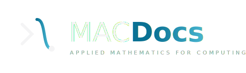

<br>
<div align="center">


</div>
<br>

<p align="center">
<strong>Language:</strong> English | <a href="README.pt.md">Português</a>
</p>

<p align="center">

</p>

<p align="center">
Interactive documentation for Applied Mathematics for Computing, rendered from MDX with LaTeX formulas, full text search, and interactive study components.
<br>
<a href="#about-the-project"><strong>Explore the documentation »</strong></a>
</p>

## Table of Contents

- [About the Project](#about-the-project)
- [Features](#features)
- [Tech Stack](#tech-stack)
- [Getting Started](#getting-started)
- [Scripts](#scripts)
- [Content](#content)
- [Architecture](#architecture)
- [Testing](#testing)
- [Deployment](#deployment)
- [License](#license)
- [Author](#author)

</br>

## About the Project

MacDocs is a fully static (SSG) documentation site in the style of react.dev. It
turns a tree of MDX files into a navigable, searchable, and interactive study
site. Adding a `.mdx` file is enough to generate a route, a sidebar entry, a
breadcrumb, previous/next navigation, and a search index entry.

## Features

- MDX rendering with GFM and KaTeX (inline and block math).
- Hierarchical sidebar derived from the folder structure, with collapsible groups
  whose state is persisted.
- Full text search opened with `Ctrl`/`Cmd` + `K`, ranked and keyboard driven.
- Interactive study components: Callout, Collapsible, Exercise, Quiz, StepByStep,
  and YouTube.
- Table of contents with scroll spy on desktop and a dropdown on mobile.
- Reading time and prerequisite chips per page.
- Light and dark theme that follows the system, with no flash.
- SEO: sitemap, robots, Open Graph, canonical URLs, and a custom 404.
- Security headers and a Content Security Policy.

## Tech Stack

- Next.js (App Router, Turbopack), React, and TypeScript in strict mode.
- Tailwind CSS v4 with the typography plugin.
- MDX via `next-mdx-remote/rsc` and `gray-matter`.
- KaTeX (`remark-math`, `rehype-katex`), `remark-gfm`, and `rehype-slug`.
- `next-themes`, `lucide-react`, and `zod`.
- Vitest with Testing Library, and Playwright with axe.
- ESLint, Prettier, Husky, commitlint, and GitHub Actions.

## Getting Started

```bash
npm install
cp .env.example .env.local   # set NEXT_PUBLIC_SITE_URL
npm run dev                  # http://localhost:3000
```

## Scripts

| Command             | Description                |
| ------------------- | -------------------------- |
| `npm run dev`       | Development server         |
| `npm run build`     | Production build (SSG)     |
| `npm run start`     | Serve the production build |
| `npm run lint`      | ESLint                     |
| `npm run typecheck` | `tsc --noEmit`             |
| `npm run format`    | Prettier (write)           |
| `npm run test`      | Vitest (watch)             |
| `npm run test:run`  | Vitest (single run)        |
| `npm run test:e2e`  | Playwright (smoke and axe) |

## Content

Content lives in [`content/`](content/), organized in three levels:

```
content/<course>/<group>/<page>.mdx
```

Creating a `.mdx` file automatically generates its route, sidebar item,
breadcrumb, previous/next navigation, and search entry. See
[docs/en/authoring.md](docs/en/authoring.md).

## Architecture

The codebase is organized feature first under `src/features/*`, with only the
genuinely shared code in `src/shared/*`. See
[docs/en/architecture.md](docs/en/architecture.md).

## Testing

- Unit and component tests with Vitest and Testing Library (`npm run test:run`).
- Smoke and accessibility tests with Playwright and axe (`npm run test:e2e`).

## Deployment

Deployment runs on Vercel, with an automatic preview per pull request and
production on merge to `main`. Vercel runs `next build`, while the
[GitHub Actions CI](.github/workflows/ci.yml) runs the quality gates (types,
lint, tests, e2e, and audit) that block the merge.

## License

Distributed under the **MIT License**. See the [LICENSE](LICENSE) file for
details.

</br>

## Author

Developed by **Dário Matias**:

- Portfolio: [https://dariomatias-dev.com](https://dariomatias-dev.com)
- GitHub: [https://github.com/dariomatias-dev](https://github.com/dariomatias-dev)
- Email: [matiasdario75@gmail.com](mailto:matiasdario75@gmail.com)
- Instagram: [https://instagram.com/dariomatias_dev](https://instagram.com/dariomatias_dev)
- LinkedIn: [https://linkedin.com/in/dariomatias-dev](https://linkedin.com/in/dariomatias-dev)
